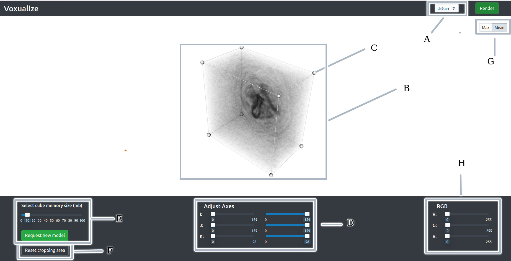

# CARTA-HONS-PROJECT Frontend

This project is a web-application that allows the user to visualize astronomical data on his / her browser. It is meant to be used in conjunction with the server created by my project partner, which is also sitting in this folder. 

The client is a React web application that connects to a C++ backend. The project allows the visualization of astronomical data-cubes. It employs a hybrid-rendering approach that allows for both interactivity and detailed analysis. 


## User-interface 

The image below shows the basic user-interface of the application:


<br/>
<br/>

 - A: File selector - Used for selecting the file to visualize
 - B: Viewing Area - This is the main area used to view the cube. When interacting with the cube, the user sees a downsampled level-of-detail (LOD) model of the cube. When the user stops interacting with the cube for around 300ms, a high quality image is sent from the server, replacing the LOD model.
 - C: Cropping widget - Allows the user to resize the data cube as you see fit. 
 - D: Axes sliders - Allows a secondary way to resize the cube. C and D are mapped together
 - E: LOD model slider- Allows the user to specify the size cube rendered by the frontend. This can make the LOD model more / less detailed depending on the setting.
 - F: Reset cube button - Resets the cube to it's default cropping regions / transfer function settings etc.
 - G: Sample type: - Allows the user to choose which sampling method to use for the LOD model
 - H: Opacity widget - Allows the user to change the opacity transfer function, and updates the model accordingly. Includes a reset button to change back to the default opacity settings.


## Running code: Prerequisites

You will need to install the following packages to get this code to run. 

- [npm](https://www.npmjs.com/)
- [docker](https://www.docker.com/)
- [protoc](https://github.com/protocolbuffers/protobuf/releases)
- [protoc-gen-grpc-web](https://github.com/grpc/grpc-web/releases)


Before running any of the commands below, make sure you cd into the src folder.
```
 $ cd src
```

## Generate Protobuf Messages and Client Service Stub

This project uses gRPC to communicate between front-end and backend. 

To generate the protobuf messages and client service stub class from your
`.proto` definitions, we need the `protoc` binary and the
`protoc-gen-grpc-web` plugin.

cd into the `voxualize-protos` folder and run:
```sh

$ git submodule init
$ git submodule update

```
Then navigate back to the `src` folder

Make sure they are both executable and are discoverable from your PATH.

When you have both `protoc` and `protoc-gen-grpc-web` installed, you can now
run the script to generate the proto code:

```sh
$ ./update-protos.sh
```

After the command runs successfully, you should now see two new files generated
in the current directory:

 - `voxualize_pb.js`
 - `voxualize_grpc_web_pb.js`

 
## Run the Code!
 
 1. Run the build script. In order for gRPC to work on the web, you need to run the Envoy Proxy. A build script has been made for this purpose. Make sure you are in the /src folder and simply run

 ```sh
 $ ./runme.sh

 ```

2. Next, we need to build and run the React front-end
```sh
$ npm install
$ npm start
```

When these are all ready, you can open a browser tab and navigate to

```
localhost:3000
```

If the server is up and running, you should be able to choose files to visualize. 